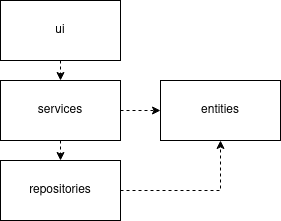

# Arkkitehtuuri

## Rakenne

Sovelluksen kerrosarkkitehtuurin karkea esitys.

## Luokkakaavio

Sovelluksen luokkakaavio, joka ei vastaa täysin sovelluksen nykytilaa, mutta esittää suuntaa, johon ollaan pyrkimässä.