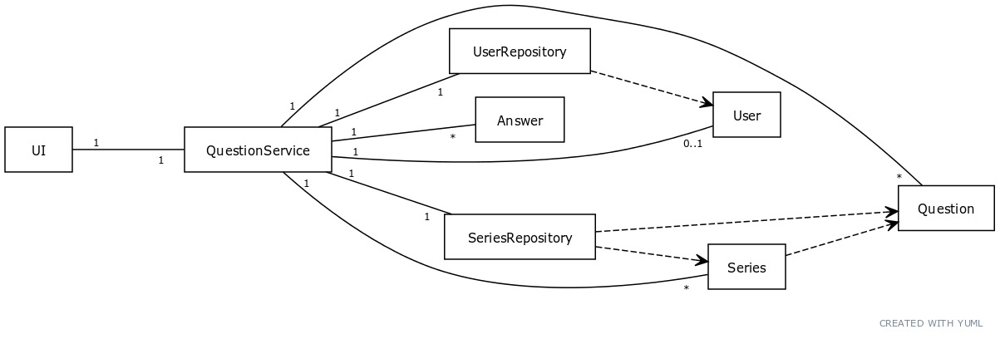

# Arkkitehtuuri

## Rakenne

Ohjelman rakenne noudattaa kerrosarkkitehtuuria. Sen pakkausrakenne on esitetty seuraavassa kuvassa:

Tässä "ui" vastaa käyttöliittymästä, "services" vastaa sovelluslogiikasta, "repositories" vastaa tietojen tallentamisesta ja "entities" sisältää käytettyjen tietokohteiden luokkia.

## Luokkakaavio

Arkkitehtuuri kuvaa tarkempi esitys sovelluksen pääasiallisista luokista ja niiden välisistä suhteista on annettu seuraavassa kuvassa:

User-luokka vastaa käyttäjää, Question-luokka vastaa kysymystä, Series-luokka vastaa kysymyssarjaa ja Answer luokka vastaa vastausta kysymykseen. UserRepository-luokka vastaa käyttäjäntiedon tallentamisesta ja hakemisesta, ja SeriesRepository-luokka vastaa kysymyksiin ja kysymyssarjoihin liittyvän tiedon tallentamisesta ja hakemisesta. QuestionService-luokka vastaa yleisestä sovelluslogiikasta ja sillä on pääsy kaikkiin edellämainittuihin luokkiin. UI-luokka sekä näkymäluokat, joita ei ole esitetty kuvassa erikseen, vastaavat graafisesta käyttöliittymästa, ja niillä on pääsy vain QuestionService-luokkaan.

## Käyttöliittymä

Käyttöliittymässä on seuraavat erilliset näkymät:

- Sisäänkirjautumisnäkymä
- Pääkäyttäjännäkymä
- Kysymyssarjalistasnäkymä
- Kysymyssarjanluontinäkymä
- Kysymyksenluontinäkymä
- Kysymysnäkymä
- Raporttinäkymä

Näkymät ovat toteutettu omina luokkinaan. Yksi näkymä on kerrallaan näkyvissä. Näkymien hallinnasta ja näyttämisestä vastaa UI-luokka. 

## Tietojen pysyväistallennus

Repositories-pakkauksen luokat UserRepository ja SeriesRepository vastaavat tietojen pysyväistallennuksesta ja tiedon hakemisesta tallennuksesta. Tieto tallennetaan SQLite-tietokantaan (yksittäiseen tiedostoon). 

Lisäksi on olmeassa erillinen csv-tiedostona "default_series.csv", joka sisältää tiedon default-kysymyssarjasta. Kun sovellus laitetaan käyttövalmiiksi build-komennolla, tällöin tietokanta alustetaan ja luodaan tarvittavat taulut. Tämän jälkeen default-kysymyssarjan tiedot luetaan csv-tiedostosta ja tallennetaan tietokantaan, josta vastaa SeriesRepository-luokka.

## Päätoiminnallisuudet

### Käyttäjän sisäänkirjautuminen

Aloitusnäkymässä kun antaa käyttänimen ja salasanan, niin tapahtuu seuraavan kuvan mukainen tapahtumaketju, olettaen, että kyseinen käyttäjä on jo olemassa tietokannassa ja kyseinen käyttäjä on pääkäyttäjä (admin). Kuvassa "User" ei tarkoita User-oliota, vaan se viittaa graafista liittymää käyttävään käyttäjään, jolle näytetään näkymiä.

Kun käyttäjä klikkaa "Login"-nappia, kutsutaan load_and_set_user-metodia, joka hakee käyttäjän tiedot UserRepository-luokan load_user-metodia käyttäen. Tässä tapauksessa käyttäjän tiedot löytyvät, joten load_and_set_user-metodi asettaa kyseisen käyttäjän tämänhetkiseksi käyttäjäksi. Tämän jälkeen UI-luokka käyttää current_user_is_admin-metodia hakeakseen tiedot siitä, onko käyttäjä pääkäyttäjä. Tässä tapauksessa näin on, joten UI-luokka näyttää pääkäyttäjännäkymän käyttäen _show_view_admin-metodia.

### Vastauksen antaminen

Kun käyttäjä antaa vastauksen kysymykseen, tapahtuu seuraava tapahtumasarja siinä tapauksessa, että vastattu kysymys ei ole kysymyssarjan viimeinen. (Kuvassa annettu vastaus on 1.) Kuvassa "User" ei tarkoita User-oliota, vaan se viittaa graafista liittymää käyttävään käyttäjään, jolle näytetään näkymiä.

Kun käyttäjä klikkaa "Give answer"-nappia, UI-luokka kutsuu QuestionService-luokan give_answer_metodia, jonka seurauksena luodiin uusi Answer-olio. QuestionService-luokka myös lisää vastauksen käsittelyssä olevien vastausten listalle. Tämän jälkeen UI-luokka kutsuu QuestionService-luokan is_series_finished-metodia, joka palauttaa tiedon, onko kaikki kysymyssarjan kysymykset käyty läpi. Tässä tapauksessa vastaus on kieltävä, joten UI-luokka näyttää käyttäjälle seuraavan kysymyksen.