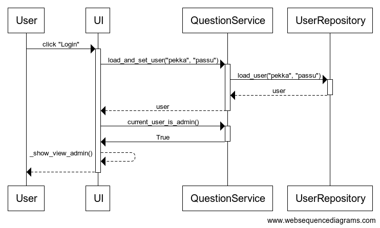

# Arkkitehtuuri

## Rakenne

Sovelluksen kerrosarkkitehtuurin karkea esitys.

## Luokkakaavio

Sovelluksen luokkakaavio, joka ei vastaa täysin sovelluksen nykytilaa, mutta esittää suuntaa, johon ollaan pyrkimässä.

## Päätoiminnallisuudet

### Käyttäjän sisäänkirjautuminen

Aloitusnäkymässä kun antaa käyttänimen ja salasanan, niin tapahtuu seuraavan kuvan mukainen tapahtumaketju, olettaen, että kyseinen käyttäjä on jo olemassa tietokannassa.

### Vastauksen antaminen

Kun käyttäjä antaa vastauksen kysymykseen, tapahtuu seuraava tapahtumasarja siinä tapauksessa, että vastattu kysymys ei ole kysymyssarjan viimeinen. (Kuvassa annettu vastaus on 1.)

