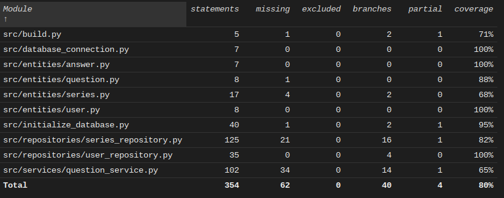

# Testausdokumentti

## Yksikkötestaus

Sovellusta on testattu yksikkötesteillä unittest-kirjastoa käyttäen manuaalisesti sovelluksen graafista käyttöliittymää käyttämällä.

### Sovelluslogiikka

TestQuestionService-oliota käytetään testaamaan QuestionService-oliota, joka vastaa sovelluslogiikasta. TestQuestionService-olion alustuksen yhteydessä sovelluksen käyttämä tietokanta alustetaan (build-funktiolla).

### Repositorio-luokat

Repositorio-luokkia UserRepository ja SeriesRepository testattaessa alustuksen yhteydessä tyhjennetään sovelluksen käyttämästä tietokannasta repositorio-olion käyttämät tietokantataulut.

### Testauskattavuus

Sovelluksen testauksen haaraumakattavuus on 80%, mutta tämä ei sisällä testausta käyttöliittymälle.

## Järjestelmätestaus

Sovelluksen järjestelmätestausta on suoritettu manuaalisesti. Sovellusta on ajettu [käyttöohjeen](./kayttoohje.md) mukaisesti kahdessa eri Linux-ympäristössä. 

Manuaalisissa testeissä sovellukselle on annettu erilaisia syötteitä. Sovellus vaikuttaa toimivan [vaatimusmäärittelyn](./vaatimusmaarittely.md) mukaisella tavalla.